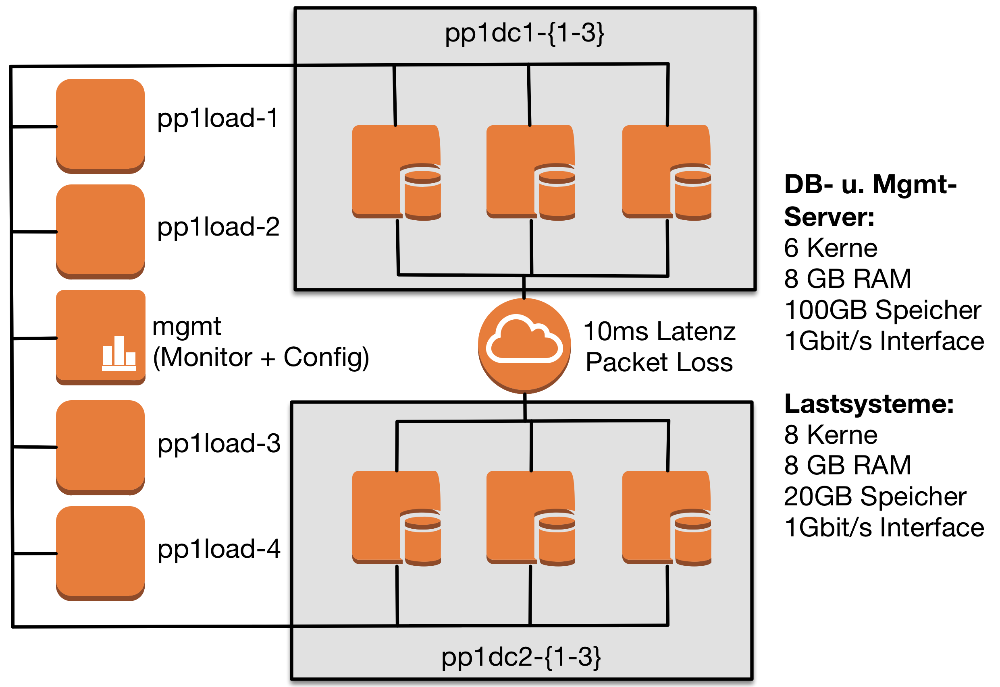
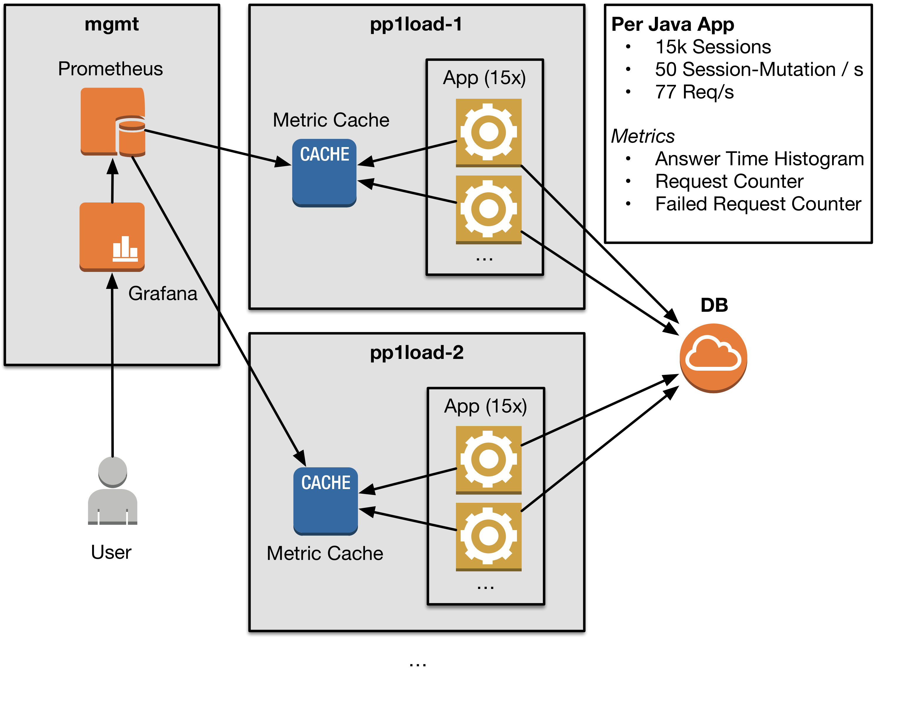
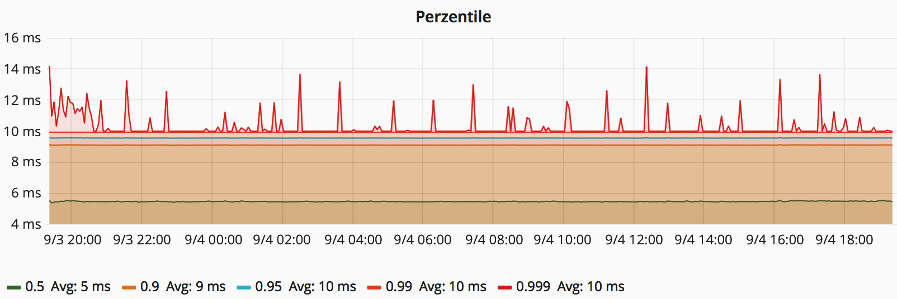
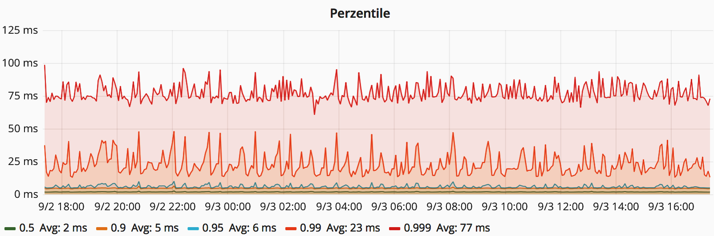
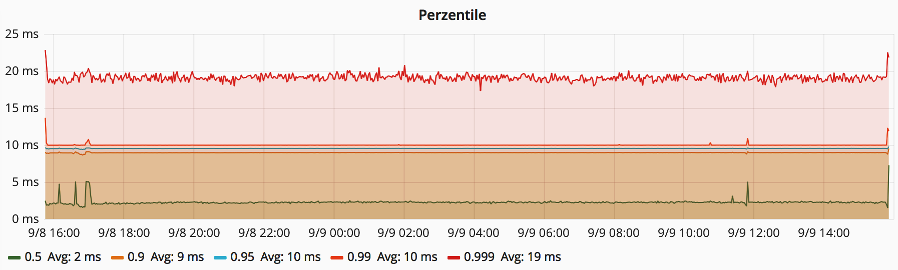

# Evaluation of distributed Key-Value Databases

This project was part of a university project. It tests the NoSQL-Databases [Redis](https://redis.io/) [(Cluster)](https://redis.io/topics/cluster-spec), [Cassandra](http://cassandra.apache.org/) and [Couchbase](https://www.couchbase.com) for the Use-Case "Distributed Key-Value Store".

For the evaluation the requirements were bound to answer-times and reliability.

## Platform setup

While performing the tests there were 11 servers set up. 6 of the servers are database-servers which are distributed accross different datacenters. The WAN-Simulation is done with the Linux Kernel-module netem. (10ms latency and 0.1% packet-loss)

There are also 4 servers for generating load against the database instances. The last server is used for management and configuration tasks.

## Architecture

The Application does connect to one database. Every application instance simulated 15000 sessions and generates insterts, updates, reads and deletes for the key-value data.

For every request the metrics are saved and pushed to prometheus via a pushgateway. Grafana is used to generate the answer-time charts at the bottom of the page.

## Software

Please visit [src](src/) for some more information about the Test Software

## Configuration

Please visit [conf](conf/) for some more information about the configuration of the hosts. It includes an Ansible-Playbook with all the needed configration.

## Answer Times

The following anser-time graphs show the answer-times for the different database products.

### Redis Cluster

### Cassandra

### Couchbase

## Documentation

For the german documentation and presentation, see the PDF-Files in this folder.
